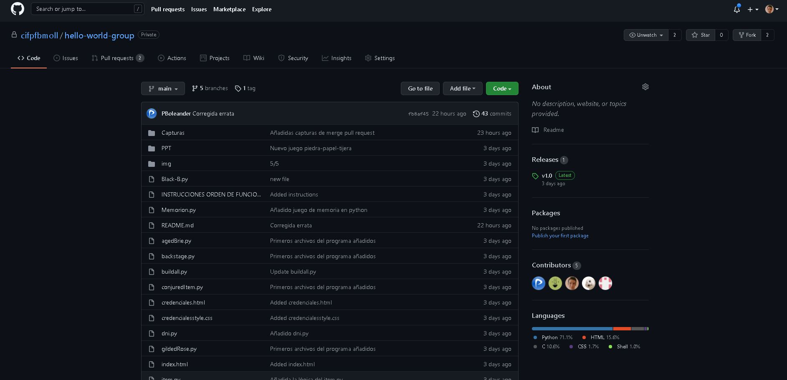
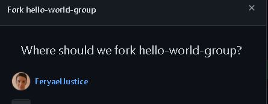
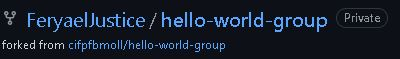
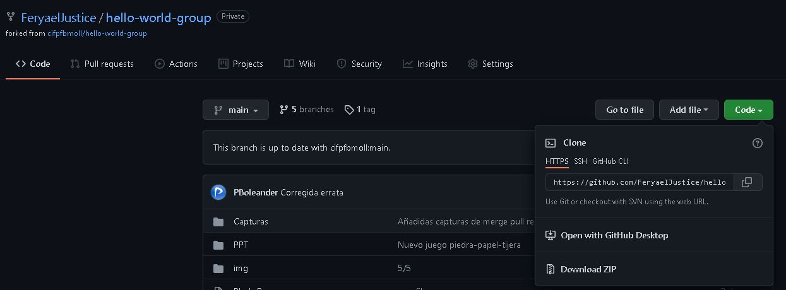
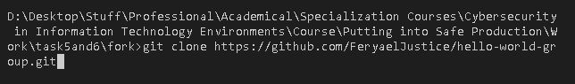
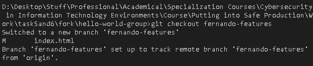
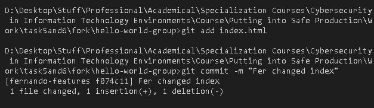
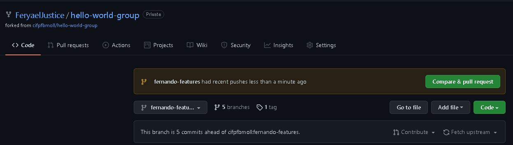
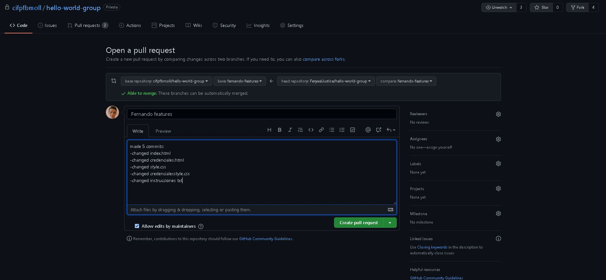

# tarea6-peps

## Tarea 6

### Enlace al vídeo explicativo: 
[Video tutorial](https://youtu.be/83IuqFAIWPg)

### Enlace al repostorio grupal:
[Repositorio grupal](https://github.com/cifpfbmoll/hello-world-group.git)

### Tarea 6 
1.  

Hacemos fork.

2.  

Elegimos a que grupo hacemos el fork.

3.  

Vemos que se ha hecho el fork en nuestro perfil o organización.

4.  

Copiamos el link del repo para el clone.

5.  

Hacemos el git clone.

6.  

Cambiamos a nuestra branch.

7.  

Hacemos cambios, git add y commit (repetimos 5 veces lo mismo con diferentes cambios a cada commit). Luego hacemos un push de todos los commits con git push.

8.  

Abrimos pull request de nuestro repo forkeado al original.

9.  

Creamos el pull request detallando qué hemos cambiado.

10. Esperamos a que la organizacion nos acepte o rechaze el pull request, o podemos cancelar el pull request dandole al botón.

### TUTORIAL GITHUB GUIDES:
1.  

Hacemos fork.

2.  

Elegimos a que grupo hacemos el fork.

3.  

Vemos que se ha hecho el fork en nuestro perfil o organización.

4.  

Copiamos el link del repo para el clone.

5.  

Hacemos el git clone.

6.  

Vemos que se ha hecho el git clone.

7.  

Hacemos cambios y hacemos git add y commit.

8.  

Hacemos push a nuestro fork.

9.  

Abrimos pull request de nuestro repo forkeado al original.

10.  

Creamos el pull request detallando qué hemos cambiado.