
# tarea6-peps

## Tarea 6

### Enlace al vídeo explicativo: 
[Vídeo tutorial](https://youtu.be/f5qvisJ6S0M)

### Enlace al repositorio grupal:
[Repositorio grupal](https://github.com/cifpfbmoll/hello-world-group.git)

### Tarea 6 
1. 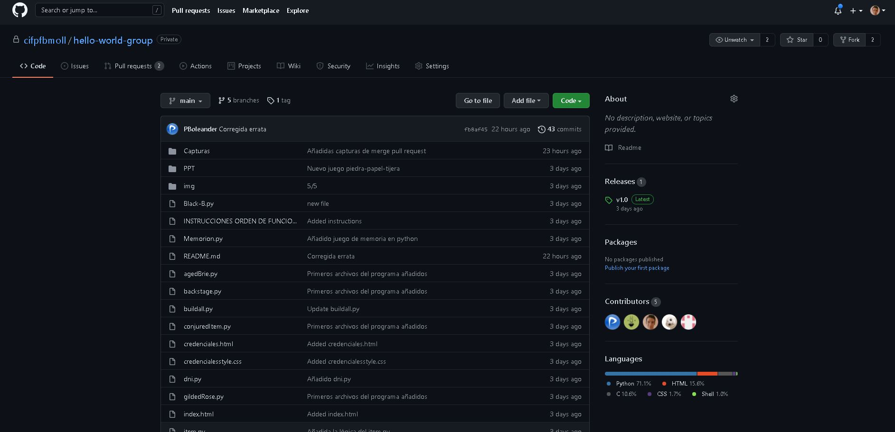 

Hacemos fork.

2. 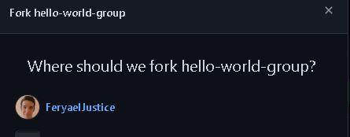 

Elegimos a qué grupo hacer el fork.

3. 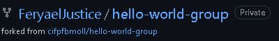 

Comprobamos que se ha creado el fork en nuestro perfil o en la organización.

4. 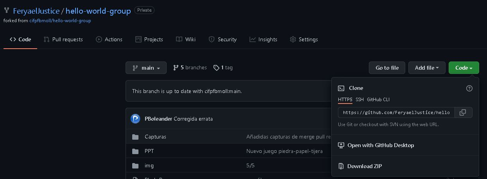 

Copiamos el enlace del repositorio para clonarlo.

5. 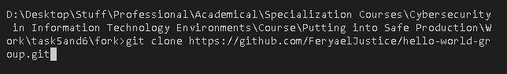 

Hacemos el git clone.

6. 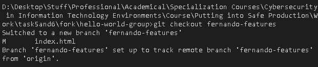 

Cambiamos a nuestra rama.

7. 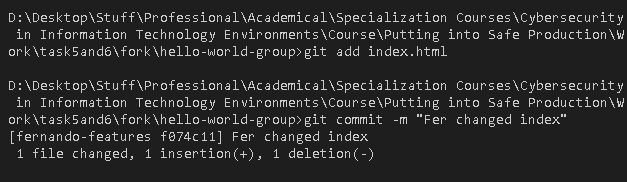 

Hacemos cambios, ejecutamos git add y hacemos commit (repetimos el proceso cinco veces, con cambios diferentes en cada commit). Después, subimos todos los commits con git push.

8. 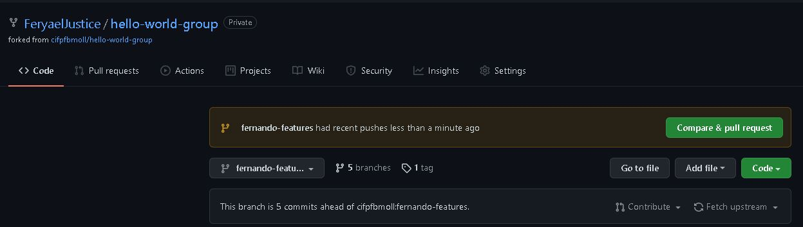 

Abrimos una pull request desde nuestro repositorio forkeado hacia el original.

9. 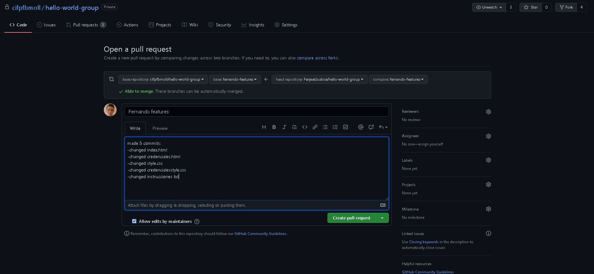 

Creamos la pull request e indicamos qué hemos cambiado.

10. Esperamos a que la organización acepte o rechace la pull request; también podemos cancelarla haciendo clic en el botón.

### TUTORIAL GITHUB GUIDES:
1. 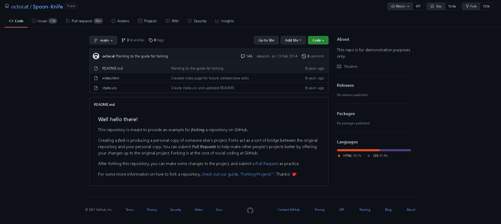 

Hacemos fork.

2. 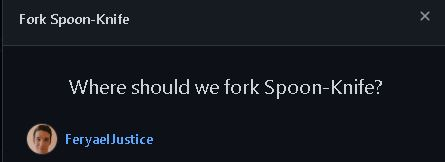 

Elegimos a qué grupo hacer el fork.

3. 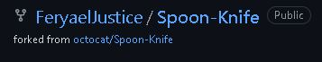 

Comprobamos que se ha creado el fork en nuestro perfil o en la organización.

4. 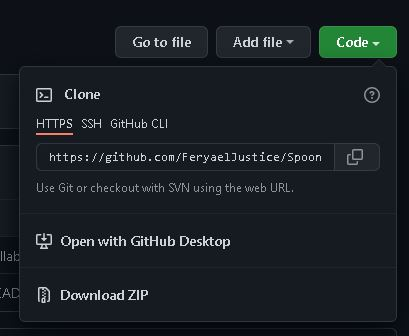 

Copiamos el enlace del repositorio para clonarlo.

5. 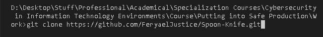 

Hacemos el git clone.

6. 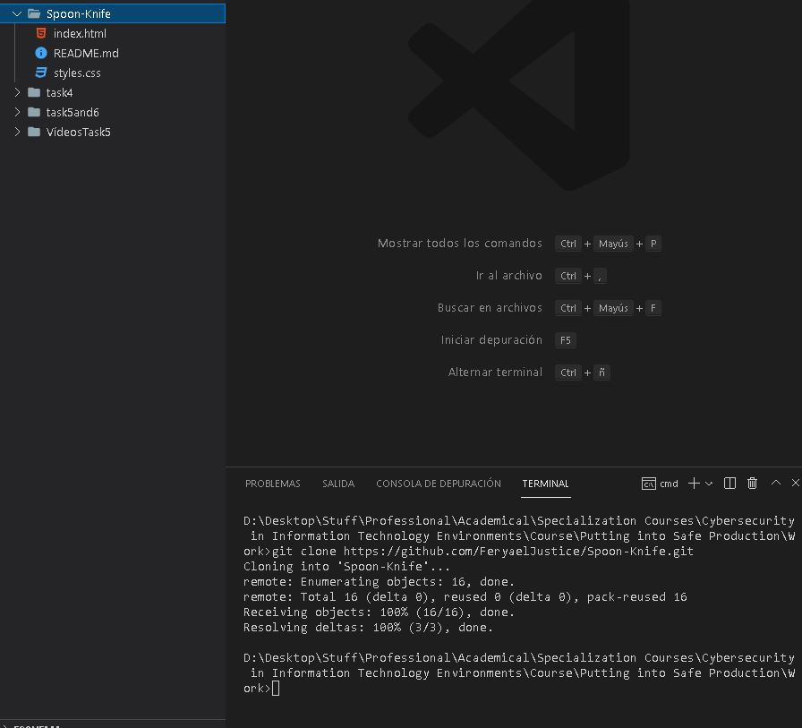 

Vemos que se ha hecho el git clone.

7. 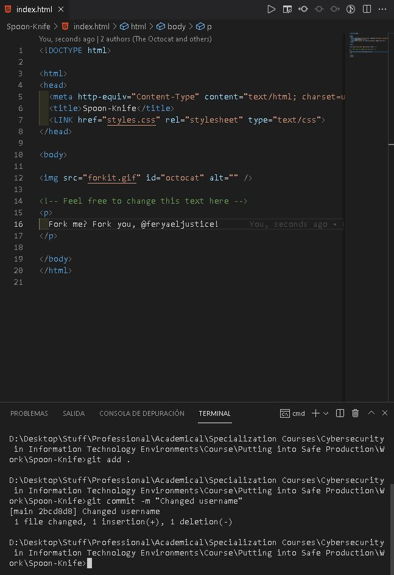 

Hacemos cambios y hacemos git add y commit.

8. 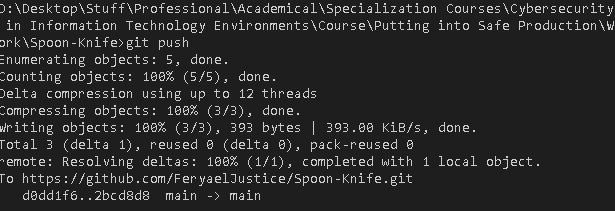 

Hacemos push a nuestro fork.

9. 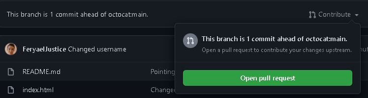 

Abrimos una pull request desde nuestro repositorio forkeado hacia el original.

10. 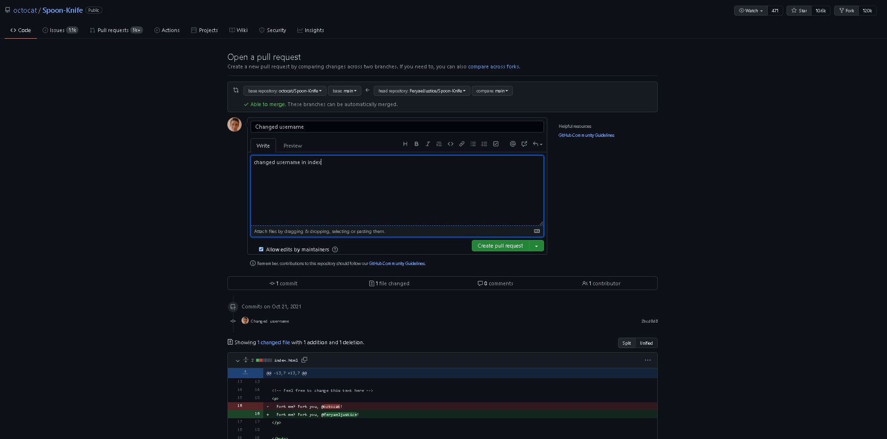 

Creamos la pull request e indicamos qué hemos cambiado.
